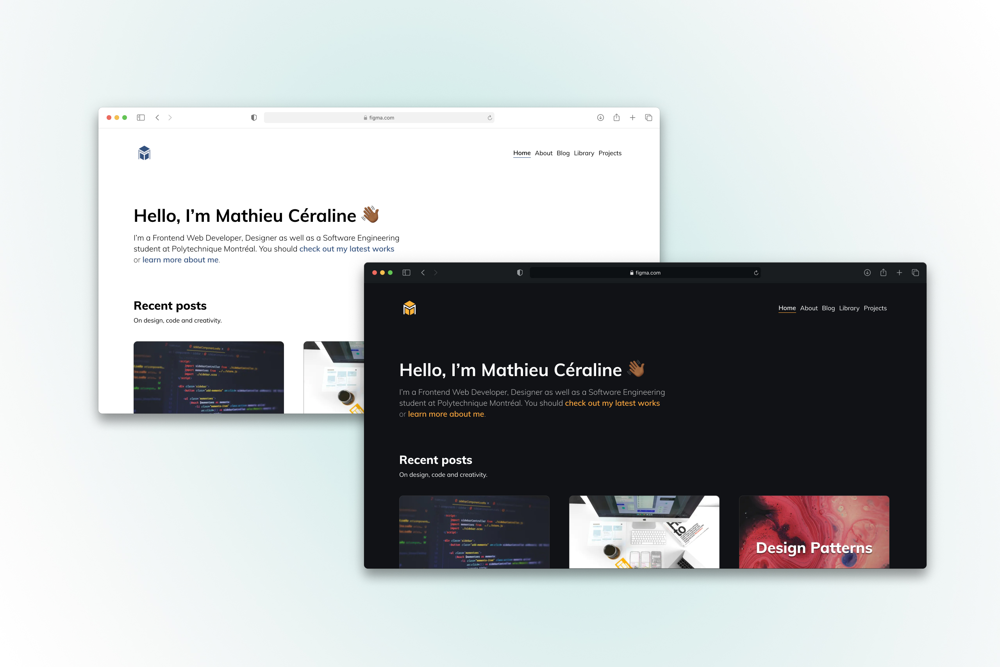

<p align="left">
   
</p>

# Jerry / mathcrln.com

[](https://github.com/mathcrln)
[](https://github.com/mathcrln/mathcrln.com/stargazers)

Jerry is the first iteration of my personal website, built with Next.js, Tailwind, GraphCMS and Apollo.



## Table of contents

-   :construction_worker: [Running locally](#construction_worker-running-locally)
-   :toolbox: [Built with](#toolbox_built-with)
-   :bust_in_silhouette: [Author](#bust_in_silhouette-author)
-   :pray: [Acknowledgments](#acknowledgments)

## :construction_worker: Running Locally

```
$ git clone https://github.com/mathcrln/mathcrln.com.git
$ cd mathcrln.com
$ cp .env.local.example .env.local
$ yarn
$ yarn dev
```

Define the environment variables by creating a .env.local file similar to [.env.local.example](https://github.com/mathcrln/mathcrln.com/blob/master/.env.local.example)

## :toolbox: Built with

-   [Next.js](https://nextjs.org/) - React framework
-   [Tailwind](https://tailwindcss.com/) - CSS framework
-   [GraphCMS](https://www.graphcms.com/) - Content management system
-   [Apollo GraphQL](https://www.apollographql.com/) - GraphQL client

## :bust_in_silhouette: Author

-   Website - [Mathieu Céraline](https://mathcrln.com/about)
-   Twitter - [@mathcrln](https://www.twitter.com/mathcrln)

## :pray: Acknowledgments

I believe that no idea comes from nothing. While I made sure not to copy anyone's work while building this project, I believe that many projects that came before paved the way for this one. We all get inspired and, as Isaac Newton cleverly said:

> “If I have seen further it is by standing on the shoulders of Giants”. — Isaac Newton

So I would like to personnally thank some people and projects I personnally took inspiration from while building this project:

-   Laura Beatris [Website](https://laurabeatris.com) / [Github](https://github.com/LauraBeatris/laurabeatris.com) / [@lauradotjs](https://twitter.com/lauradotjs)
-   Brian Lovin [Website](https://brianlovin.com) / [Github](https://github.com/brianlovin/briOS) / [@brianlovin](https://twitter.com/brian_lovin)
-   Josh W. Comeau [Website](https://joshwcomeau.com) / [Github](https://github.com/joshwcomeau) / [@JoshWComeau](https://twitter.com/JoshWComeau)
-   Maggie Appleton [Website](https://maggieappleton.com) / [Github](https://github.com/MaggieAppleton) / [@Mappletons](https://twitter.com/Mappletons)
